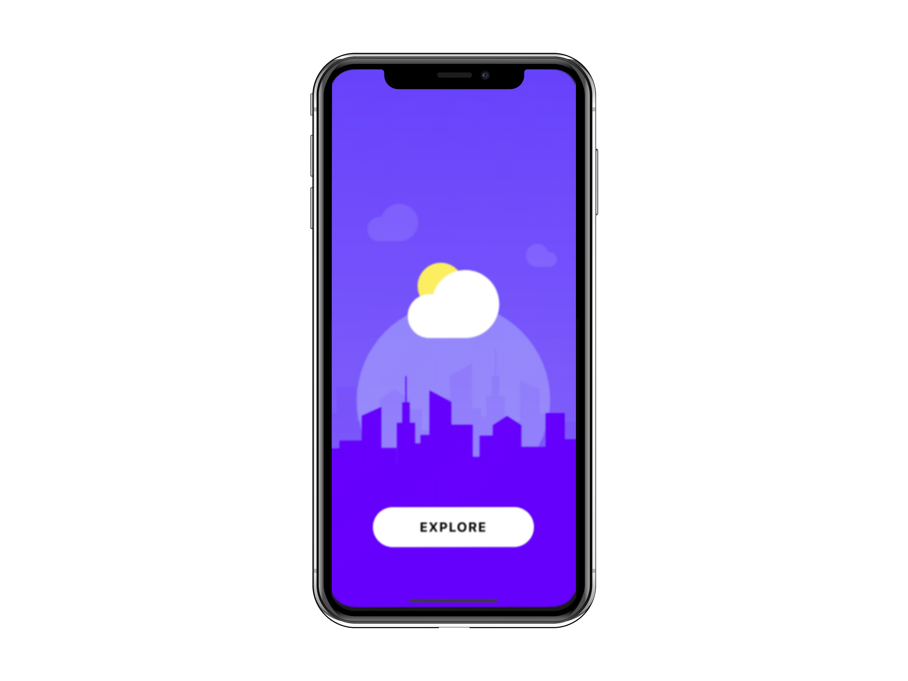

<h1 align="center">
   </br>
  DiWeather
</h1>

<p align="center">
  

  <a href="https://github.com/diazevedo">
    
  </a>

  
</p>

<h2 align="center">
  
  
  
</h2>

### Description

This is a mobile forecast application.

The layout was designed by [Raman Yv](https://www.uplabs.com/ramandesigns9).

### Technologies / Libraries

- [React](https://reactjs.org/)
- [React Navigation](https://reactnavigation.org/)
- [React Native Gesture Handler](https://docs.swmansion.com/react-native-gesture-handler/)
- [React Native Modalize](https://github.com/jeremybarbet/react-native-modalize)
- [Redux](https://redux.js.org/introduction/getting-started)
- [Styled Components](https://styled-components.com/)
- [Reactotron](https://github.com/infinitered/reactotron)
  - [reactotron-react-native](https://github.com/infinitered/reactotron/blob/master/docs/quick-start-react-native.md)
  - [reactotron-redux](https://github.com/infinitered/reactotron/blob/master/docs/plugin-redux.md)

### Running the project

Requirements

- [Node](https://nodejs.org/en/).
- [Yarn](https://yarnpkg.com/) or [NPM](https://www.npmjs.com/) — I am using yarn commands over this step-by-step.

```bash
# Open a terminal

# clone this repository
$ git clone https://github.com/diazevedo/DiWeather.git

# Go to the repository folder
$ cd DiWeather

# Run the below command to install dependencies
yarn

# You will need an api key to be included into your .env file that you have to create as well.
# The api used was https://openweathermap.org/
# With you api key added to your .env you are good to run the application

# To run the application
# app was tested only in IOS. Android Version is coming soon
yarn ios


```

:bulb: Feel free to comment or to contribute with this project any thoughts on how to improve are welcome.
